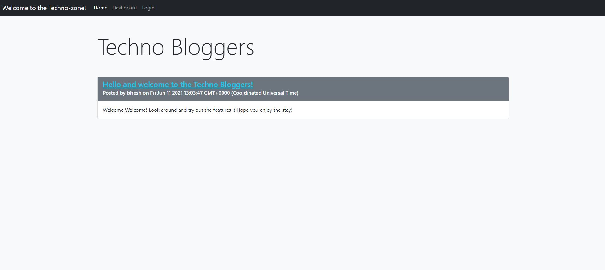
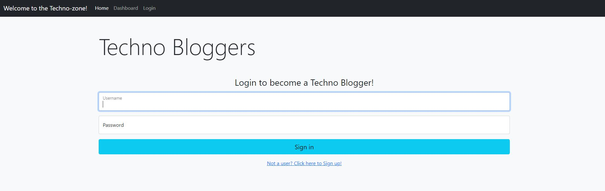
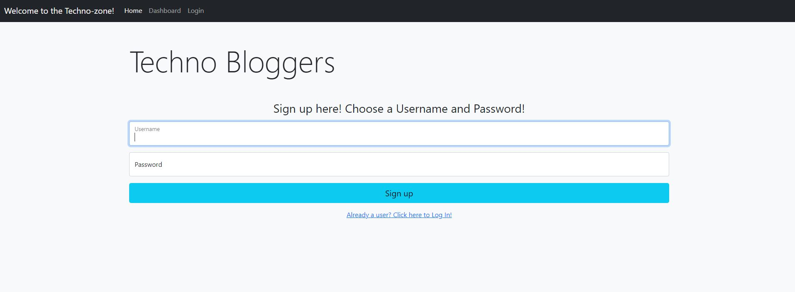
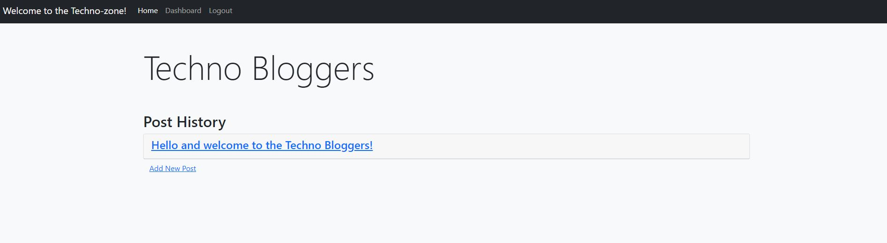
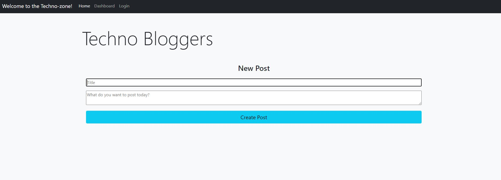
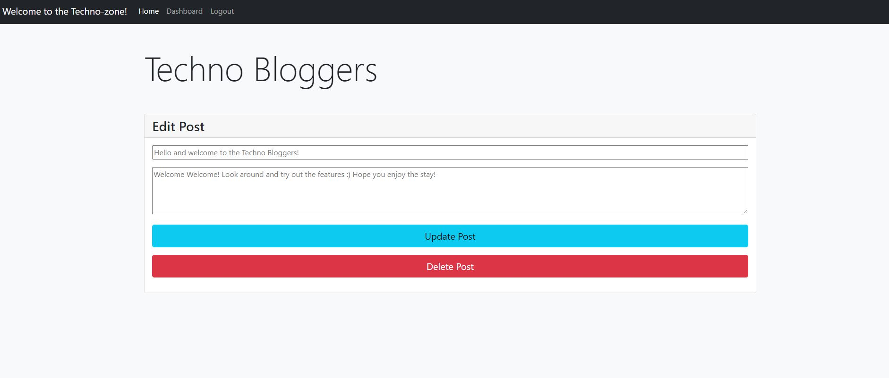

# MVC Tech Blog

  

  ## Table of Contents
  - [Description](#description)
  - [Installation](#installation)
  - [Usage Information](#usage-information)
  - [License](#license)
  - [Contribution Guidelines](#contribution-guidelines)
  - [Test Procedure](#test-procedure)
  - [Questions](#questions)
  - [Images](#images)

  ## Description
  A CMS-style blog, similar to a Wordpress site, where users can publish their blog posts and comment on other developers posts as well. It follows the MVC paradigm in its architectural structure, using Handlebars.js as the templating language, Sequelize as the ORM, and the express-session npm package for authentication. It will then be deployed on Heroku.

  [Click here to access Techno Bloggers!](https://techno-bloggers.herokuapp.com/)

  ## Installation
  - git clone
  - npm i
  - npm run seed 
  - npm start

  ## Usage Information
  Use this application to launch a fully functional blog site, where users can sign up and log in. From there, they can create posts which they can edit and delete or leave comments on other users posts.

  ## License
  MIT

  ## Contribution Guidelines
  Contribute freely

  ## Test Procedure
  n/a

  ## Questions
  If you have any questions, then feel free to contact me on the below:
  - Github: [bdjm94](https://github.com/bdjm94)
  - Email: [brendandjmoore@gmail.com](brendandjmoore@gmail.com)

  ## Images
| Home Page |
|------------|
  

| Log In Page |
|------------|
  

| Sign Up Page |
|------------|
  

| Dashboard Page |
|------------|
  

| Add New Post |
|------------|
  

| Edit/Delete Posts |
|------------|
    